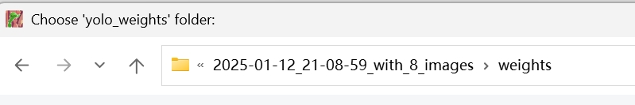
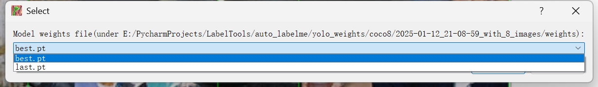
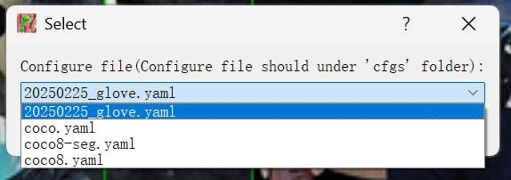
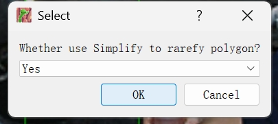
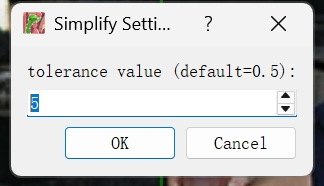
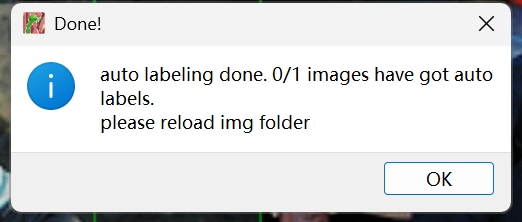
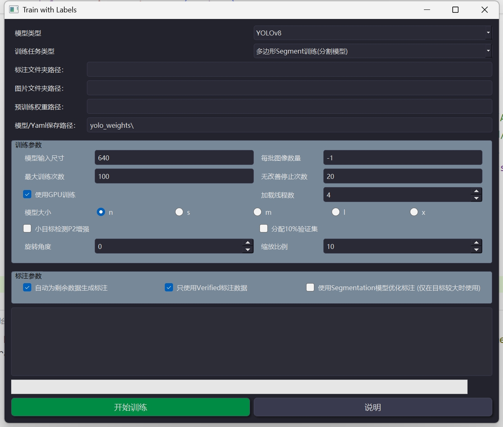

# AUTO-LABELME

基于Labelme、SAM series、YOLO series等前沿框架与模型，设计了Auto-Labelme软件

## 特色之处

- [x] 支持少样本标注，在少量标注数据的基础上，运用SAM算法、预训练Yolo自动生成无标签数据的伪标签，扩充标注数据量
- [x] 借助Clip和SAM series等模型，对标注结果进行自动微调，提升标注的精准度
- [x] 兼容各类模型的数据格式，实现一键式导出
- [x] 零代码操作完成训练与评估的便捷功能
- [ ] 支持多人协同标注作业
- [ ] 利用数据库存储标签和图片

## 安装方法

安装方法与Labelme相同，另外需要配置SAM2和Ultralystic，请参考对应的开源库

## 自动标注

  
  
  
  
  
  

## 训练界面

  

## Acknowledgement

本项目基于 [wkentaro/labelme](https://github.com/wkentaro/labelme).
