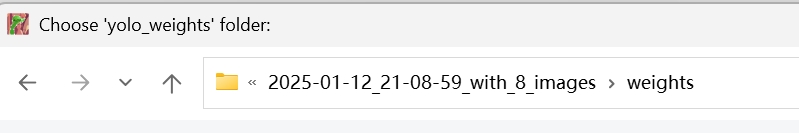
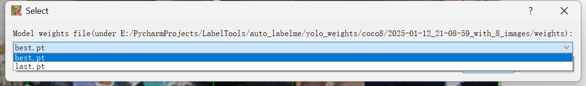
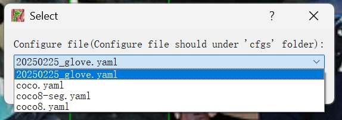
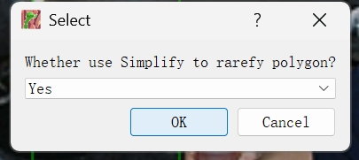
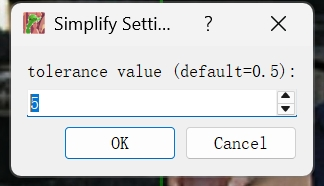
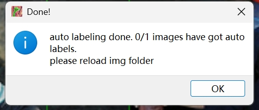
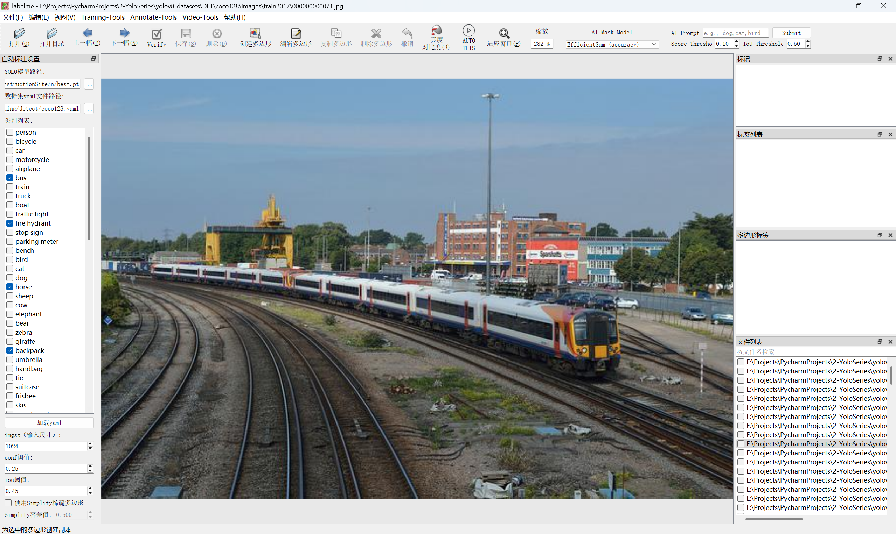
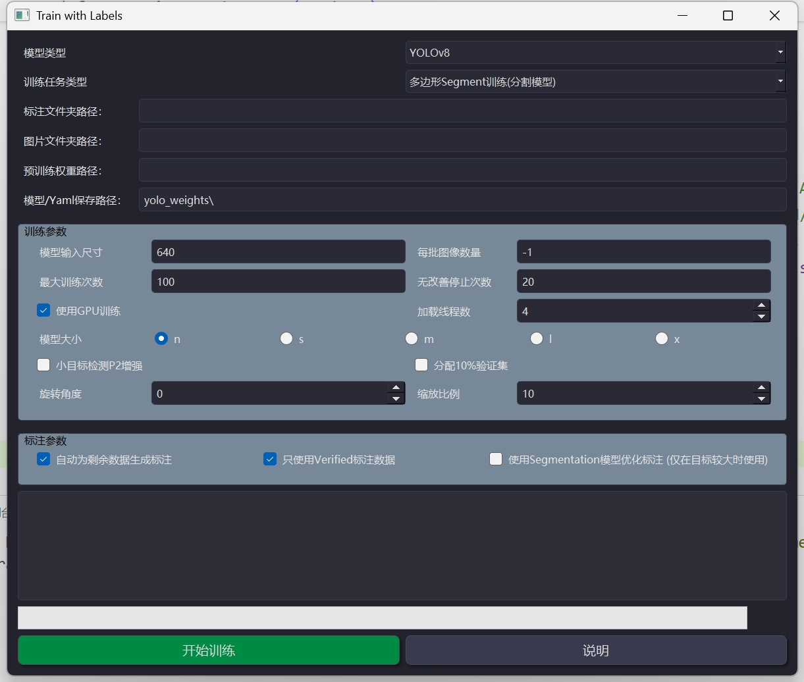

# AUTO-LABELME

基于Labelme、SAM series、YOLO series等前沿框架与模型，设计了Auto-Labelme软件

## 特色之处

- [x] 支持少样本标注，在少量标注数据的基础上，运用SAM算法、预训练Yolo自动生成无标签数据的伪标签，扩充标注数据量
- [x] 借助Clip和SAM series等模型，对标注结果进行自动微调，提升标注的精准度
- [x] 兼容各类模型的数据格式，实现一键式导出
- [x] 零代码操作完成训练与评估的便捷功能
- [ ] 支持多人协同标注作业
- [ ] 利用数据库存储标签和图片
- [ ] 支持联网使用私人网盘的模型和配置


## 安装方法

安装方法与Labelme相同，另外需要配置SAM2和Ultralystic，请参考对应的开源库 

建议使用 Anaconda 创建虚拟环境，命令如下：
conda env create -f conda_environment.yml
会创建一个名称为 auto-labelme 的虚拟环境

## 自动标注
<div align="center">
  
  
  
  
  
  
  
</div>

## YOLO 模型训练 Windows
目前虽然可以有无代码的可视化训练界面，但是功能不完整，建议还是使用ultralystic的训练方法
<div align="center">
  
</div>

## WebUI 推理界面

## YOLO 模型训练 WebUI

基于 Ultralytics YOLO 框架的可视化目标检测模型训练平台。

### 功能特点

- 🎯 **可视化界面**: 无需编写代码即可完成 YOLO 模型全流程训练
- 📊 **数据管理**: 支持多种数据集格式，自动校验和分割
- ⚙️ **参数配置**: 灵活的模型和训练参数配置
- 🚀 **训练监控**: 实时训练进度和指标可视化
- 📈 **结果分析**: 详细的训练结果分析和可视化
- 📤 **模型导出**: 支持多种格式的模型导出

### 环境要求

- Python 3.8+
- CUDA 11.0+ (GPU训练推荐)
- 至少 8GB RAM
- 至少 10GB 可用磁盘空间

### 安装步骤

1. 克隆项目或下载源代码
2. 安装依赖:
```bash
pip install -r requirements.txt
```

## Acknowledgement

本项目基于 [wkentaro/labelme](https://github.com/wkentaro/labelme).
